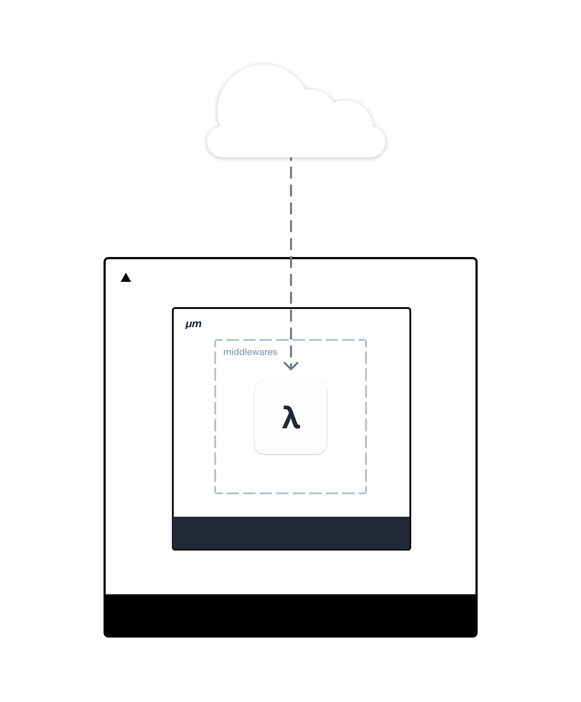

# Intro
Writing production-ready lambda services can require quite a bit of boilerplate. __micron__ was created to improve that experience by providing powerful helpers that allow you to create expressive and highly composable lambdas.

# What is Vercel?
​Vercel is a cloud platform for static sites and Serverless Functions that fits perfectly with your workflow. It enables developers to host Jamstack websites and web services that deploy instantly, scale automatically, and requires no supervision, all with no configuration.
